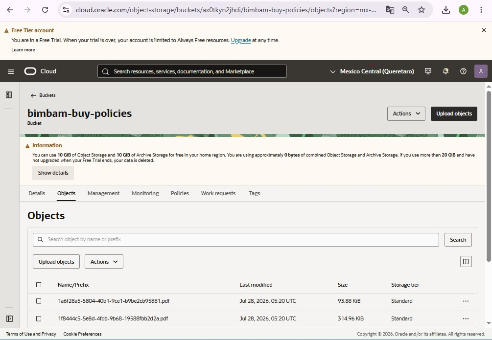

# 🛍️ Asistente Virtual de Políticas — BimBam Buy

Asistente virtual (chatbot con RAG) que permite a cualquier persona de la empresa **BimBam Buy**
(e-commerce multiplataforma enfocado en la experiencia de compra digital ágil y segura) consultar
en lenguaje natural las políticas internas de la empresa (reembolsos, programa de afiliados,
logística, soporte, etc.) a partir de documentos PDF oficiales.

## 🧠 Arquitectura

```
PDFs de políticas (docs/) 
      → se dividen en fragmentos (LangChain Text Splitter)
      → se convierten en vectores (Google Gemini Embeddings)
      → se guardan en una base vectorial (Chroma)
      → el usuario pregunta en la interfaz (Streamlit)
      → se buscan los fragmentos más relevantes
      → el modelo Gemini genera la respuesta usando solo esos fragmentos
```

**Tecnologías:** Python · LangChain · Google Gemini API · ChromaDB · Streamlit · Oracle Cloud Infrastructure (OCI)

## 📂 Estructura del proyecto

```
bimbam-buy-assistant/
├── app.py                # Aplicación principal (Streamlit + LangChain)
├── requirements.txt       # Librerías necesarias
├── .env.example           # Plantilla de variables de entorno
├── .gitignore
└── docs/                  # Coloca aquí tus PDFs de políticas
```

## ▶️ Cómo ejecutarlo en tu computadora

1. Clona este repositorio y entra a la carpeta:
   ```bash
   git clone <URL-de-tu-repo>
   cd bimbam-buy-assistant
   ```
2. Crea un entorno virtual e instala las dependencias:
   ```bash
   python -m venv venv
   venv\Scripts\activate        # En Windows
   source venv/bin/activate     # En Mac/Linux
   pip install -r requirements.txt
   ```
3. Copia `.env.example` a `.env` y coloca tu API key de Gemini (obtenla gratis en
   [Google AI Studio](https://aistudio.google.com/app/apikey)):
   ```
   GOOGLE_API_KEY=tu_api_key_aqui
   ```
4. Coloca tus archivos PDF de políticas dentro de la carpeta `docs/`.
5. Ejecuta la app:
   ```bash
   streamlit run app.py
   ```
6. Se abrirá en tu navegador en `http://localhost:8501`.

## ☁️ Despliegue

- **Aplicación (interfaz + lógica del asistente):** desplegada en **Streamlit Community Cloud**.
  👉 URL en vivo: [https://bimbam-buy-assistant-4q8q6ptbhvjno8q4acrhww.streamlit.app/](https://bimbam-buy-assistant-4q8q6ptbhvjno8q4acrhww.streamlit.app/)
- **Servicio de Oracle Cloud Infrastructure (OCI) utilizado:** **OCI Object Storage**, usado como
  repositorio de respaldo de los documentos oficiales de políticas (bucket `bimbam-buy-policies`).

## 🎥 Demo en la nube

**Captura del asistente funcionando en Streamlit Community Cloud:**


**Captura del bucket de OCI Object Storage con los documentos:**



## ⚠️ Nota

Este proyecto fue desarrollado como práctica de un curso. Los documentos de políticas de
"BimBam Buy" son de carácter ilustrativo/ficticio.
